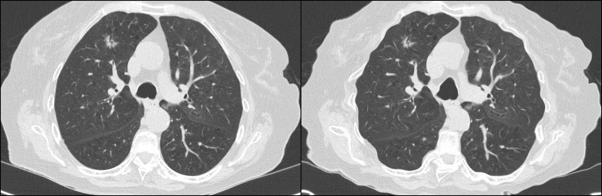

# Differentiable Elastic Transform based on Kornia



## Usage

Transform input image as follows.
```
import elastic_transform

from PIL import Image

image = torchvision.transforms.ToTensor()(Image.open('base/lungs.jpg))[None][:,[0]]
et = elastic_transform.ElasticTransform(alpha=1,  sigma=12, random_seed=42)
image_transformed = et.forward(image)
```

## Example
Run `python example.py`, it will give the output as the image above.


